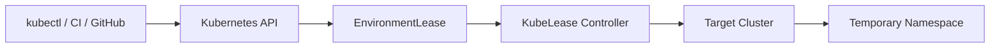

<p align="center">
  <picture>
    <source media="(prefers-color-scheme: dark)" srcset="assets/logo-dark.svg">
    
  </picture>
</p>

# KubeLease

**Ephemeral Kubernetes environments that clean themselves up.**

[](https://github.com/hghukasyan/kubelease/actions/workflows/ci.yml)
[](https://go.dev/)
[](LICENSE)
[](https://goreportcard.com/report/github.com/hghukasyan/kubelease)

KubeLease is a Go Kubernetes Operator that gives temporary development environments
an explicit lifecycle — TTLs, renewal, idle expiration, policy controls, GitHub PR
integration, and multi-cluster placement.

<p align="center">
  
</p>

## Quick Start

One-command local demo (Kind + controller + sample lease):

```bash
make demo
```

Or create a lease against an already-installed controller:

```bash
make cli && export PATH="$PWD/bin:$PATH"
kubectl kubelease create demo --ttl 30m --max-ttl 2h
kubectl kubelease list
```

## Why KubeLease?

Preview environments are easy to create and surprisingly easy to forget.

A failed CI cleanup step can leave Namespaces, Pods, LoadBalancers, PVCs, and other
resources running long after a pull request is closed.

KubeLease gives temporary environments an explicit lifecycle.

```text
Without KubeLease              With KubeLease
─────────────────              ──────────────
PR opened                      PR opened
   ↓                              ↓
preview namespace               EnvironmentLease (ttl=8h)
   ↓                              ↓
PR abandoned                   preview namespace
   ↓                              ↓
environment remains            TTL / idle / PR close
   ↓                              ↓
resources + cost accumulate    automatic cleanup
```

## What it does

A PR opens. CI (or a developer) requests an 8-hour lease. KubeLease creates a
constrained preview Namespace. The developer can renew it if needed. The PR closes —
or the lease expires — and KubeLease verifies ownership before cleaning up.

```yaml
apiVersion: platform.kubelease.io/v1alpha1
kind: EnvironmentLease
metadata:
  name: payment-pr
spec:
  ttl: 8h
  maxTTL: 72h
  renewable: true
  policyRef:
    name: preview-default
  placement:
    selector:
      matchLabels:
        kubelease.io/region: us-east
```

Full API details: [docs/environment-lease.md](docs/environment-lease.md).
More manifests: [examples/](examples/).

## How it works



```text
TTL / idle / PR close
        ↓
   Reconcile
        ↓
Ownership-verified cleanup
```

## Features

| | |
|---|---|
| **Automatic expiration** | TTLs and hard maximum lifetimes (`maxTTL`) |
| **Renewable leases** | Extend without allowing forever-lived environments |
| **Idle expiration** | Heartbeat via `kubectl kubelease touch`; expire unused sandboxes |
| **Self-healing** | Deleted/managed ResourceQuota, LimitRange, NetworkPolicy are reconciled |
| **Policy controls** | Enforce TTL caps, quotas, NetworkPolicy, and placement rules |
| **Multi-cluster** | Place environments on registered `ClusterTarget` clusters |
| **GitHub integration** | Create/expire leases from pull request lifecycle events |
| **Observable** | Prometheus metrics, Kubernetes Events, structured status Conditions |

## Use cases

- Per-PR preview namespaces that expire with the PR or a TTL
- Time-boxed developer scratch environments
- CI job isolation with automatic teardown
- Platform-enforced default-deny networking for ephemeral workloads
- Multi-cluster placement by region or tier labels

## When should I use KubeLease?

**Use KubeLease when:**

- preview environments should expire automatically
- developers need temporary sandboxes
- CI creates namespaces dynamically
- multiple clusters host ephemeral environments
- TTL, policy, and quotas should be centrally controlled

**KubeLease is not:**

- a replacement for Argo CD
- a Helm deployment engine
- a Kubernetes scheduler
- a CI system
- a cloud cost platform

### How it differs from generic janitors

Generic cleanup tools often delete resources based on age or annotations.
KubeLease models the temporary environment itself as a first-class Kubernetes
resource with lifecycle, status, policy, renewal, source integration, and
multi-cluster placement.

## CLI

```bash
kubectl kubelease create demo --ttl 30m
kubectl kubelease list
kubectl kubelease get demo
kubectl kubelease extend demo --for 15m
kubectl kubelease touch demo
kubectl kubelease expire demo
kubectl kubelease cluster list
```

Install from source:

```bash
go install github.com/hghukasyan/kubelease/cmd/kubectl-kubelease@latest
```

Or build locally: `make cli` → `bin/kubectl-kubelease`.

## Multi-cluster

Register remote clusters as `ClusterTarget` resources, then place leases with
`spec.clusterRef` or `spec.placement.selector`. Placement is sticky once a
Namespace exists.

See [docs/multicluster.md](docs/multicluster.md) and
[docs/multicluster-security.md](docs/multicluster-security.md).

## Policies

`EnvironmentLeasePolicy` sets hard limits (TTL, quotas, NetworkPolicy, placement).
Leases that violate policy are rejected with clear status Conditions.

See [docs/policies.md](docs/policies.md).

## GitHub integration

<p align="center">
  
</p>

HMAC-verified GitHub webhooks create and expire leases from PR events.
See [docs/github-integration.md](docs/github-integration.md).

## Observability

Prometheus metrics (bounded labels), Kubernetes Events, and Conditions such as
`Ready`, `TargetClusterReady`, and cleanup failures.
See [docs/observability.md](docs/observability.md).

## Installation

**Prerequisites:** Kubernetes cluster, `kubectl`, Docker (for local demo).

### Local demo (recommended first try)

```bash
make demo        # Kind cluster + install + sample lease
make demo-clean  # delete the demo Kind cluster
```

### From source / Kind

```bash
make install          # CRDs
make docker-build IMG=kubelease:dev
kind load docker-image kubelease:dev
# point config/manager image, then:
make deploy
make cli
```

### Helm (in-repo chart)

Install CRDs first (this chart does not own CRD lifecycle):

```bash
make install
helm upgrade --install kubelease charts/kubelease \
  --namespace kubelease-system --create-namespace \
  --set image.repository=ghcr.io/hghukasyan/kubelease \
  --set image.tag=<tag>
```

Release binaries and container images are published when a `v*` tag is cut
(GoReleaser). Until then, build from source.

Details: [docs/installation.md](docs/installation.md).

## Documentation

| Doc | Description |
|---|---|
| [Getting started](docs/getting-started.md) | Zero → first lease |
| [Installation](docs/installation.md) | Install options |
| [Concepts](docs/concepts.md) | Leases, policies, phases |
| [EnvironmentLease](docs/environment-lease.md) | API overview |
| [Policies](docs/policies.md) | Platform guards |
| [Multi-cluster](docs/multicluster.md) | ClusterTarget + placement |
| [GitHub](docs/github-integration.md) | PR webhooks |
| [Webhooks](docs/webhook-integration.md) | Generic HTTP source |
| [Observability](docs/observability.md) | Metrics & Events |
| [Notifications](docs/notifications.md) | Events/metrics today; outbound roadmap |
| [Versioning](docs/versioning.md) | v0.x / release policy |
| [Security](docs/security.md) | Threat model notes |
| [Operations](docs/operations.md) | Runbooks |
| [Troubleshooting](docs/troubleshooting.md) | Common failures |
| [Architecture](docs/architecture.md) | Control plane design |
| [Design decisions](docs/design-decisions.md) | Why these choices |

## Design principles

- **Kubernetes-native** — desired state lives in Kubernetes APIs
- **Safe cleanup** — ownership verified before destructive operations
- **Idempotent** — reconciliation can safely run repeatedly
- **Policy controlled** — users cannot bypass platform-defined limits
- **Failure aware** — cluster and external failures appear in status

## Roadmap

**Current**

- TTL / maxTTL leases and renewal
- Policies and idle expiration
- GitHub + generic webhook sources
- Multi-cluster placement and security hardening
- Prometheus metrics and Helm chart

**Next**

- Richer placement strategies
- Additional source integrations
- Advanced activity signals
- Optional UI
- Published OCI Helm chart / Homebrew formula (after first release)

## Built with

Go · Kubebuilder · controller-runtime · Kubernetes · Cobra · Prometheus · Helm

## Contributing

See [CONTRIBUTING.md](CONTRIBUTING.md). Questions and ideas: GitHub Discussions
(when enabled) or Issues. Bug reports: use the issue templates.

If KubeLease is useful in your workflow, consider starring the repository — it
helps others discover the project.

## Community

- [Bug reports](https://github.com/hghukasyan/kubelease/issues/new?template=bug_report.yml)
- [Feature requests](https://github.com/hghukasyan/kubelease/issues/new?template=feature_request.yml)
- [Documentation improvements](https://github.com/hghukasyan/kubelease/issues/new?template=documentation.yml)
- [Contributing guide](CONTRIBUTING.md)
- [Security policy](SECURITY.md)
- [Code of conduct](CODE_OF_CONDUCT.md)

## License

Apache License 2.0. See [LICENSE](LICENSE).

---

**Repository metadata (GitHub About)**

| Field | Recommended value |
|---|---|
| Description | Kubernetes-native lifecycle management for ephemeral development environments. |
| Website | _(leave empty, or link README/docs)_ |
| Topics | `kubernetes` `golang` `operator` `kubebuilder` `controller-runtime` `devops` `platform-engineering` `preview-environments` `kubernetes-operator` `cloud-native` `multi-cluster` `ci-cd` `developer-tools` |

Social preview source: [docs/assets/social-preview.png](docs/assets/social-preview.png) (1280×640).
Set under Settings → General → Social preview.
